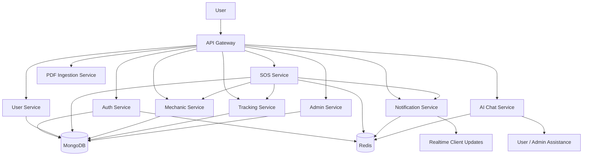

# SOS Vehicle 🚨

SOS Vehicle is a microservice-based emergency assistance platform designed to help users request roadside support quickly, connect with nearby mechanics, and receive real-time updates during an emergency. This repository contains the backend system that powers the complete workflow from user registration to SOS request handling, mechanic assignment, tracking, notifications, and administrative monitoring.

---

## Overview

This project was built as a modern, modular backend architecture for a vehicle emergency assistance system. Instead of keeping everything in one large application, the system is divided into independent services so each part can be developed, tested, deployed, and scaled separately.

The main goal of this project is to make emergency support fast, reliable, and transparent for three primary groups:

- Users who need urgent help
- Mechanics who provide assistance
- Admins who monitor and manage the platform

---

## What we have built in this project

### 1. User authentication and authorization

We implemented a dedicated authentication service that handles:

- User registration
- User login
- Secure password handling
- JWT-based authentication
- Token validation for protected routes

This keeps account access secure and allows other services to trust the identity of the requesting user.

### 2. User management module

The user service manages the core profile information of each account, including:

- User profile creation
- User data retrieval
- Profile updates
- User-related business operations

This makes the platform ready for future features such as preferred vehicles, saved addresses, service history, or personal preferences.

### 3. SOS emergency request workflow

One of the central features of the project is the SOS request flow. We built a dedicated emergency handling service for:

- Creating SOS requests
- Managing request status
- Tracking the lifecycle of an emergency case
- Handling requests from a user to a mechanic
- Supporting future escalation and assignment logic

This is the heart of the platform because it connects a user in distress with the support network.

### 4. Mechanic management and coordination

The mechanic service is responsible for the mechanic side of the platform. It includes:

- Mechanic-related data management
- Service availability handling
- Coordination with SOS requests
- Support for future location-based matching and assignment logic

This allows the system to build a structured support network around emergency requests.

### 5. Real-time tracking and monitoring

The tracking service is designed to support live location-related workflows. It helps the system manage:

- Location-based operations
- Tracking context for ongoing assistance
- Monitoring of movement during a request lifecycle

This makes the system more practical for real-world roadside assistance scenarios.

### 6. Real-time notifications

A notification service was implemented to support instant communication. It is built around real-time event-driven messaging so the platform can notify users or mechanics when important events happen, such as:

- A new SOS request is created
- A mechanic is assigned
- A request changes status
- A notification needs to be delivered immediately

This improves responsiveness and gives the platform a more interactive feel.

### 7. Admin management capabilities

The admin service provides a backend layer for operations and supervision. It supports:

- Administrative oversight
- System-level monitoring
- Data management for the platform
- Future dashboard and reporting capabilities

This ensures the system is not just user-facing, but also manageable from an operations perspective.

### 8. AI-powered document and chat capabilities

The project also includes advanced services for AI-based assistance:

- PDF ingestion service for uploading and processing documents
- AI chat service for conversational support
- Knowledge-based ingestion and retrieval workflow

These modules make the platform more extensible and future-ready for assistant-style support, intelligent documentation handling, and smart conversation flows.

### 9. API Gateway for unified access

We implemented an API Gateway as the single entry point for clients. This layer:

- Routes requests to the correct service
- Centralizes external access
- Helps keep internal services decoupled
- Supports authentication and request control

This is a key part of the microservice design and simplifies client integration.

### 10. Containerized deployment and environment orchestration

The project includes Docker and Docker Compose support so the backend can be run in a consistent environment. We set up:

- Service-specific Dockerfiles
- A shared Docker Compose configuration
- Container networking between services
- MongoDB and Redis support for the backend ecosystem

This makes local development and deployment much easier and more reproducible.

### 11. Testing foundation

The services are structured with test support using Jest and Supertest. This provides a starting point for:

- Unit tests
- Route-level validation
- Service behavior checks
- Regression protection during future changes

---

## Architecture of the system

The SOS Vehicle platform follows a microservices architecture. Each service focuses on a specific responsibility, and communication is coordinated through the API Gateway and shared infrastructure.

### Main components

- API Gateway: receives client requests and forwards them to the appropriate service
- Auth Service: handles authentication and security
- User Service: manages user accounts and profile operations
- Mechanic Service: manages mechanic-related workflows
- SOS Service: handles emergency requests and request lifecycle
- Tracking Service: supports location-based operations
- Notification Service: delivers real-time alerts and updates
- Admin Service: provides monitoring and management capabilities
- AI Chat Service: provides conversational assistance
- PDF Ingestion Service: processes uploaded documents and knowledge content
- MongoDB: stores persistent application data
- Redis: supports caching and event-driven communication

---

## How the system works

A typical flow in this application looks like this:

1. A user registers or logs in through the authentication flow.
2. The user creates an SOS request from the application.
3. The request passes through the API Gateway and reaches the SOS service.
4. The SOS service coordinates with the mechanic service and relevant modules.
5. Tracking and notification services help monitor and communicate the progress of the request.
6. Admins can oversee activity and manage the system.
7. If needed, AI and document services can support advanced assistance workflows.

This design makes the platform modular and easier to extend over time.

---

## Technology stack

The project uses a modern backend stack centered on Node.js and Express.

- Runtime: Node.js
- Framework: Express.js
- Database: MongoDB
- Cache / event support: Redis
- Real-time communication: Socket.IO
- Authentication: JWT + bcrypt
- Testing: Jest + Supertest
- Containerization: Docker + Docker Compose
- Logging: Morgan / Winston
- Environment management: dotenv

---

## Project structure

```text
sos-backend/
├── admin-service/
├── ai-chat-service/
├── api-gateway/
├── auth-service/
├── docker/
├── mechanic-service/
├── notification-service/
├── pdf-ingestion-service/
├── scripts/
├── sos-service/
├── tracking-service/
├── user-service/
└── README.md
```

Each service contains its own source code, configuration, and tests, which keeps the platform organized and maintainable.

---

## Running the project

### Start all backend services with Docker

```bash
cd sos-backend
./scripts/start-all.sh
```

### Stop all backend services

```bash
cd sos-backend
./scripts/stop-all.sh
```

### View service logs

```bash
cd sos-backend
docker compose -f docker/docker-compose.yml logs -f
```

### Run a service locally

```bash
cd sos-backend/auth-service
npm install
npm run dev
```

You can repeat the same pattern for other services such as user-service, sos-service, mechanic-service, and tracking-service.

---

## Testing

Each service has test support and can be tested individually.

```bash
cd sos-backend/auth-service
npm test
```

You can run tests in the same way for the other services that include test scripts.

---

## Why this architecture was chosen

This project was designed using microservices because emergency assistance systems need to be:

- Flexible
- Modular
- Easy to scale
- Easy to maintain
- Ready for future integrations

By separating responsibilities, the system can evolve without turning into a tightly coupled monolith.

---

## Project flow diagram



---

## Summary

SOS Vehicle is a complete backend foundation for an emergency roadside assistance platform. We implemented a modular microservice architecture with authentication, user management, SOS workflows, mechanic coordination, tracking, notifications, administration, and AI-enabled services. The project is structured to be scalable, containerized, and ready for future frontend integration and production deployment.
